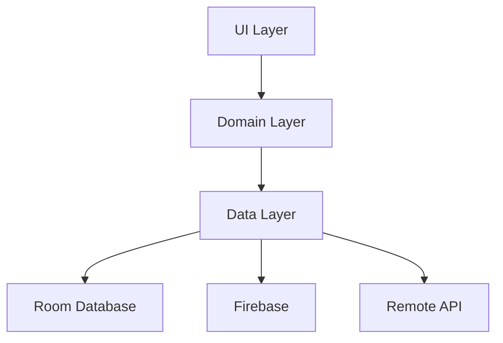
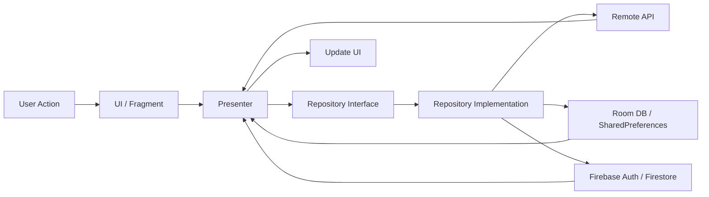

# 🍽️ MealMate


<p align="center">
  
</p>

**Meal Discovery & Planning App for Android**

FoodPlanner (MealMate) is a full-featured Android application that helps users discover meals, explore categories and countries, save favorites, and build personalized weekly meal plans — with a clean UI, offline-friendly behavior, and smart synchronization.

---

## 📚 Table of Contents
- [Features](#-features)
- [Screenshots](#-screenshots)
- [Architecture](#-architecture)
- [Tech Stack](#-tech-stack)
- [Project Structure](#-project-structure)
- [Data Flow](#-data-flow)
- [Offline \& Sync](#-offline--sync)
- [App Flow](#-app-flow)
- [Setup](#️-setup)
- [API](#-api)
- [Challenges](#️-challenges)
- [Solutions](#-solutions)
- [Future Improvements](#-future-improvements)
- [License](#-license)

---

## ✨ Features

### 🔐 Authentication
- Login / Sign up with Firebase Authentication
- Persistent session handling
- Guest mode support
- Logout flow

### 🍽 Meal Discovery
- Meal of the Day
- “For You” recommended meals
- Browse categories and countries
- Detailed meal screen with ingredients, steps, and video tab
- Smart search functionality

### ❤️ Favorites
- Add / remove favorite meals
- Offline access using Room

### 📅 Meal Planning
- Weekly meal planner
- Add / remove meals by day
- Organized plan structure

### 🌐 Offline & Sync
- Room local database
- Connectivity observer
- Pending actions handling
- Automatic sync when internet returns
- Backup & Restore support

### 🌍 Personalization
- Dark / Light mode
- Arabic / English support

### 🎨 UI / UX
- Material Design components
- Custom snackbar system
- Smooth and structured Android UI

---

## 📱 Screenshots

| Splash | Onboarding | Login |
|---|---|---|
|  |  |  |

| Home Dark | Home Light | Search |
|---|---|---|
|  |  |  |

| Meal Details | Favorites | Plans |
|---|---|---|
|  |  |  |

| Profile |
|---|
|  |

---

## 🏗 Architecture

This project follows a layered **MVP Architecture** with clear separation between **UI**, **Domain**, and **Data** layers.



---

## 🛠 Tech Stack

- Java
- XML
- MVP Architecture
- RxJava3
- Retrofit
- Room Database
- Firebase Authentication
- Firebase Firestore
- Navigation Component
- Glide
- SharedPreferences
- Material Components

---

## 📂 Project Structure

```text
com.aalaa.foodplanner
│
├── data
│   ├── datasource.remote
│   │   ├── MealRemoteDataSource
│   │   └── MealServices
│   │
│   ├── db
│   │   ├── AppDatabase
│   │   ├── Converters
│   │   ├── FavoriteMealDao
│   │   ├── FavoriteMealEntity
│   │   ├── PendingAction
│   │   ├── PendingActionDao
│   │   ├── PlanDao
│   │   └── PlanEntity
│   │
│   ├── firebase
│   │   ├── auth
│   │   │   ├── FirebaseAuthService
│   │   │   └── FirebaseAuthServiceImpl
│   │   ├── firestore
│   │   │   ├── FirestoreService
│   │   │   └── FirestoreServiceImpl
│   │   ├── FirebaseModule
│   │   └── UserSessionManager
│   │
│   ├── local
│   │   ├── FavoritesLocalDataSource
│   │   ├── PlansLocalDataSource
│   │   ├── SessionManager
│   │   ├── SharedPreferencesHelper
│   │   └── SharedPreferencesKeysConfig
│   │
│   ├── network
│   │   ├── ConnectivityObserver
│   │   └── Network
│   │
│   └── repository
│       ├── AuthRepositoryImpl
│       ├── FavoritesRepositoryImpl
│       ├── MealRepositoryImpl
│       ├── PlanRepositoryImpl
│       └── SyncRepositoryImpl
│
├── domain
│   ├── models
│   │
│   ├── repository
│   │
│   └── usecase
│
├── ui
│   ├── authentication
│   │   ├── base
│   │   ├── presenter
│   │   └── view
│   │
│   ├── categories
│   ├── common
│   ├── countries
│   ├── detail
│   ├── favorites
│   ├── home
│   ├── listing
│   ├── plans
│   ├── profile
│   └── search
│
├── MainActivity
├── OnboardingFragment
└── SplashFragment
```

---

## 📊 Data Flow



---

## 🔄 Offline & Sync

- User actions are stored locally when offline
- Pending operations are tracked in local storage / database
- `ConnectivityObserver` monitors network status
- Sync logic is handled through repository and policy layers
- Once the connection is restored, pending actions can be pushed to Firebase

---

## 🔄 App Flow

1. Splash Screen
2. Onboarding (first-time users)
3. Login / Continue as Guest
4. Home Screen
5. Browse meals by category / country
6. Open meal details
7. Add to favorites or meal plan
8. Sync data when connection is available

---

## ⚙️ Setup

### Prerequisites
- Android Studio
- JDK
- Firebase project
- Internet connection
- `google-services.json` inside the `app/` folder

### Steps
1. Clone the repository

```bash
git clone https://github.com/Aalaa-Adel/FoodPlanner.git
```

2. Open the project in Android Studio

3. Add your `google-services.json` file inside:

```text
app/
```

4. Sync Gradle

5. Build and run the project

---

## 🌐 API

The application consumes a meal API to fetch:

- Meals
- Categories
- Countries
- Ingredients
- Meal details
- Search results

---

## ⚠️ Challenges

- Handling offline actions and syncing later
- Managing multiple data sources (Room + Firebase + API)
- Keeping UI responsive with asynchronous operations
- Maintaining clean separation across layers

---

## ✅ Solutions

- Implemented a PendingAction system
- Used Repository pattern for abstracted data flow
- Applied RxJava3 for reactive and asynchronous handling
- Separated concerns into UI / Domain / Data layers

---

## 🚧 Future Improvements

- Meal reminder notifications
- Better recommendation logic
- Tablet support
- More performance optimization
- UI animation enhancements

---

## 📄 License

This project is licensed under the **MIT License**.
