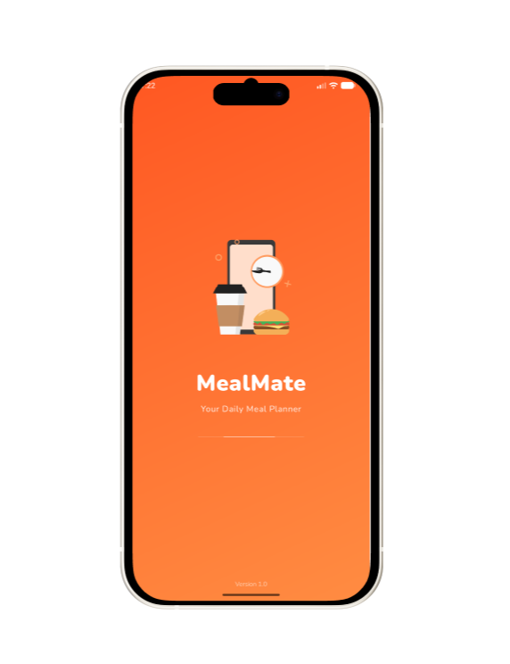
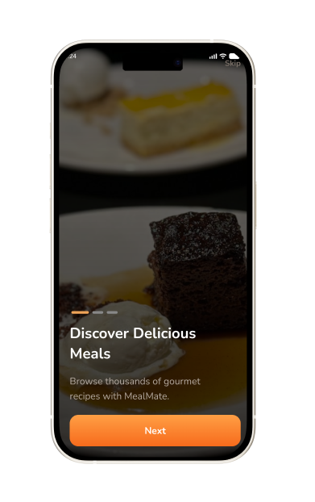
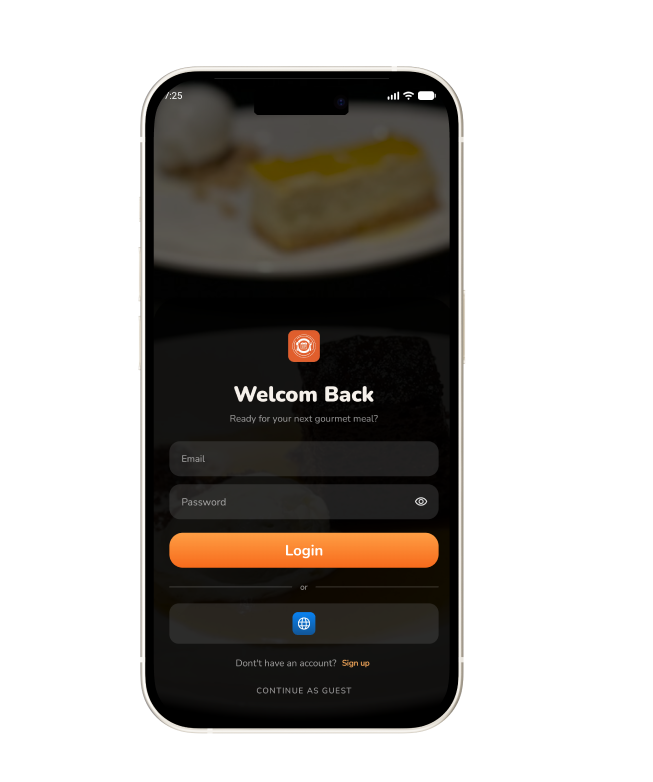
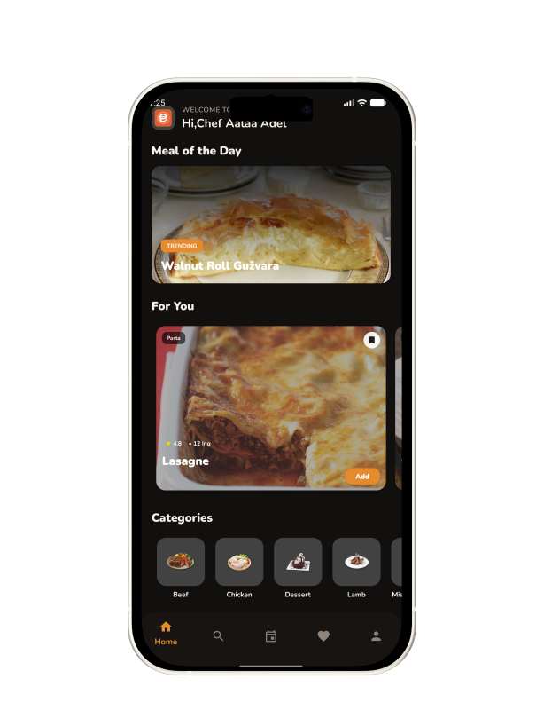
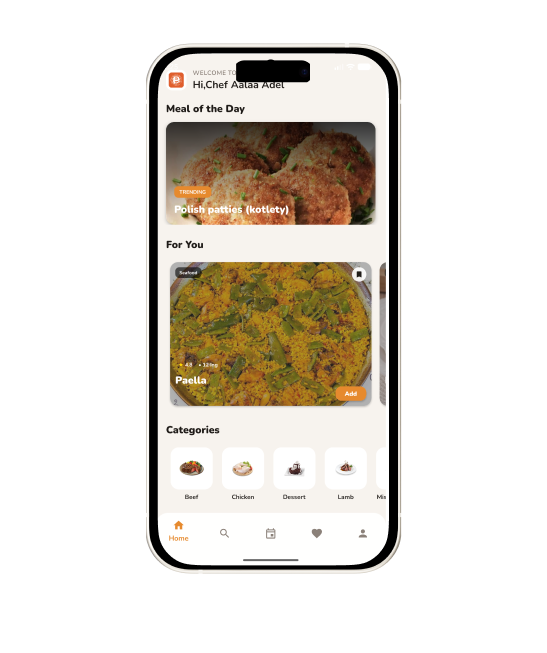
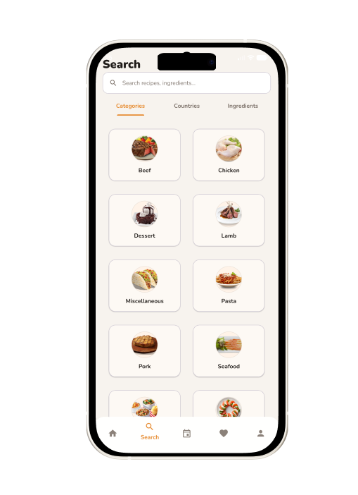
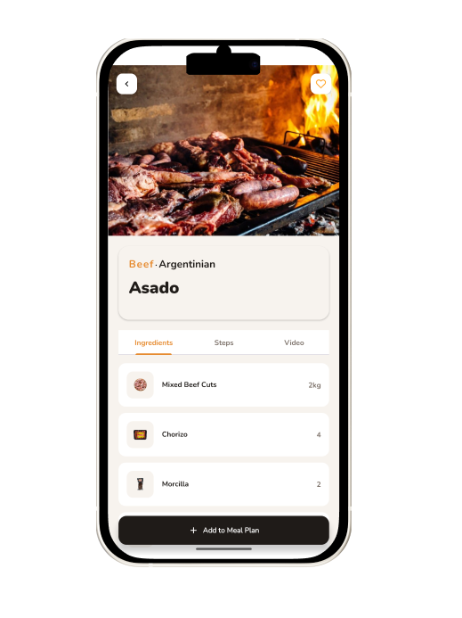
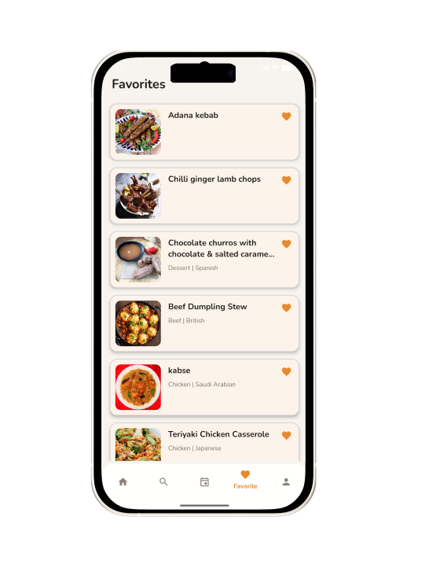
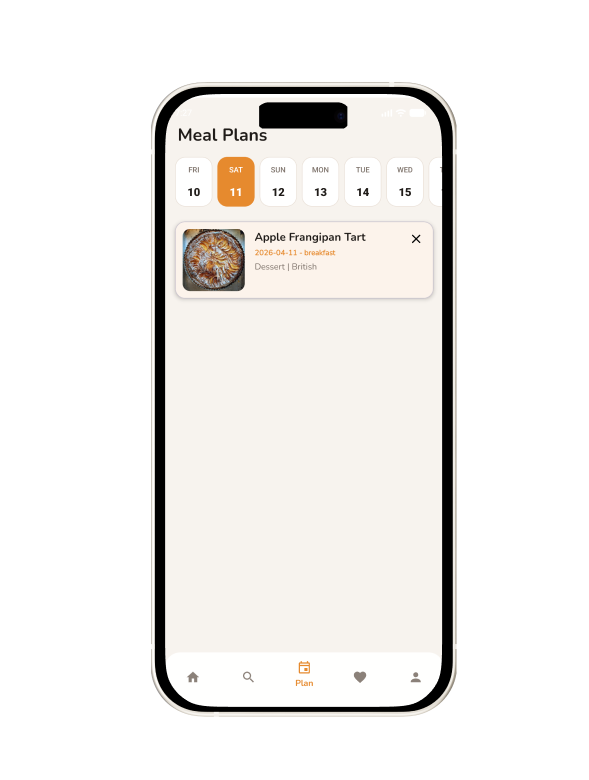
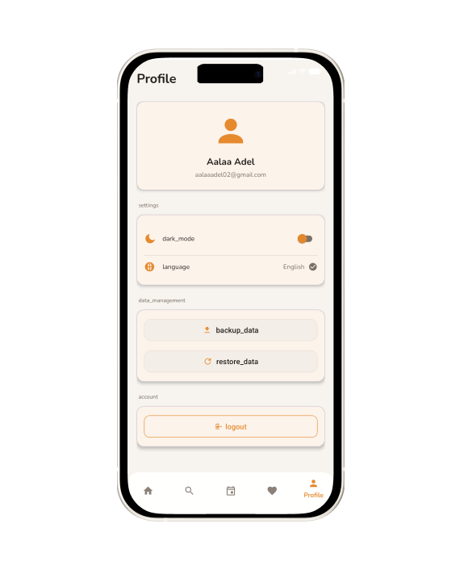

# 🍽️ MealMate


**Meal Discovery & Planning App for Android**

FoodPlanner (MealMate) is a full-featured Android application that allows users to discover meals, explore categories and countries, save favorites, and build personalized meal plans — with offline-first support and smart synchronization.

---

## 📚 Table of Contents
- [Features](#-features)
- [Screenshots](#-screenshots)
- [Architecture](#-architecture)
- [Tech Stack](#-tech-stack)
- [Project Structure](#-project-structure)
- [Data Flow](#-data-flow)
- [Offline & Sync](#-offline--sync)
- [App Flow](#-app-flow)
- [Setup](#️-setup)
- [API](#-api)
- [Challenges & Solutions](#️-challenges)
- [Future Improvements](#-future-improvements)
- [License](#-license)

---

## ✨ Features

### 🔐 Authentication
- Firebase Authentication (Login / Sign up)
- Persistent session management
- Guest mode support

### 🍽 Meal Discovery
- Meal of the Day
- “For You” personalized meals
- Browse by categories & countries
- Full meal details (ingredients / steps / video)
- Smart search functionality

### ❤️ Favorites
- Add / remove favorite meals
- Offline support using Room

### 📅 Meal Planning
- Weekly meal planner
- Add/remove meals per day
- Organized plan structure

### 🌐 Offline & Sync
- Local Room database
- Connectivity observer
- Pending actions system
- Auto-sync when internet returns

### 🎨 UI / UX
- Material Design
- Dark / Light mode
- Multi-language (Arabic / English)
- Smooth and clean UI

---

## 📱 Screenshots

| Splash | Onboarding | Login |
|---|---|---|
|  |  |  |

| Home Dark | Home Light | Search |
|---|---|---|
|  |  |  |

| Meal Details | Favorites | Plans |
|---|---|---|
|  |  |  |

| Profile |
|---|
|  |

---

## 🏗 Architecture

```mermaid
flowchart TD
    UI[UI Layer] --> DOMAIN[Domain Layer]
    DOMAIN --> DATA[Data Layer]
    DATA --> ROOM[Room Database]
    DATA --> FIREBASE[Firebase]
    DATA --> API[Remote API]
